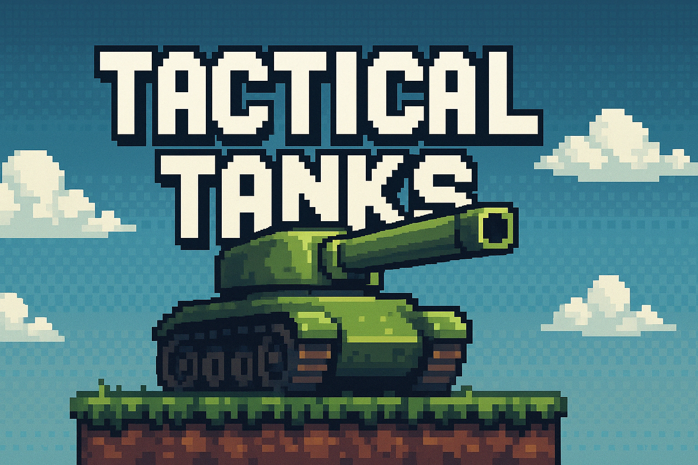

# Tactical Tanks 🎮💣

  

## 📝 Sobre o Projeto

**Tactical Tanks** é um jogo multiplayer local de combate tático por turnos, desenvolvido por **Filipi Biazoto** e **Jean Pasquini**. Criado com foco em estratégia, física e jogabilidade destrutiva, o jogo mergulha os jogadores em arenas dinâmicas onde o terreno é tão perigoso quanto o inimigo.

Neste universo alternativo pixelado, tanques futuristas batalham por supremacia em cenários como desertos, bases militares e cidades arruinadas. A jogabilidade mistura mira precisa com destruição de terreno e uso tático do ambiente para superar o adversário.

📄 O Game Design Document (GDD) está disponível no repositório para mais detalhes sobre mecânicas, personagens, cronograma de desenvolvimento e muito mais.

## 🔧 Principais Mecânicas

- 🔁 **Sistema de turnos** com tempo limitado para ação.
- 💥 **Cenários destrutíveis** e elementos indestrutíveis estratégicos.
- 🧠 **Física de projéteis** realista que exige cálculo de ângulo e força.
- 🛠️ **Tanques com atributos únicos**: velocidade, resistência e poder de fogo.
- 🌧️ **Cenários vivos** com clima, explosões de fundo e obstáculos naturais.

## 🎨 Estética e Som

- Gráficos **Pixel Art 16x16** com atenção a detalhes visuais retrô.
- Trilha sonora **inspirada em jogos 8-bit**, com batidas eletrônicas e militares.
- Efeitos sonoros dinâmicos que acompanham a ação em tempo real.

## 🧪 Desenvolvimento

O jogo foi totalmente planejado e executado com organização em Trello, versionamento via Git, e um cronograma detalhado que cobre desde a criação do GDD até o polimento final. Elementos extras como galeria de arte, trilha sonora exclusiva e making-of também estão previstos para enriquecer a experiência do jogador.

## 📥 Como Jogar

- Controle por **teclado e mouse**
- Escolha entre **4 tanques únicos**
- Dispute partidas de **5, 10 ou 15 rounds**
- Vença por dano total ou eliminação tática

## 🤝 Créditos

Desenvolvido por:

- **Filipi Biazoto**  
- **Jean Pasquini**

## 📎 Anexos

- [📘 GDD - Tactical Tanks (PDF)](./GDD%20-%20Tactical%20Tanks.pdf)

---

> Tactical Tanks não é apenas um jogo sobre destruir o inimigo — é sobre dominar o terreno, controlar seu tempo e pensar um passo à frente. Pronto para a guerra?

